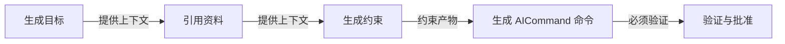

你正在执行 ESFramework Agent Artifact Generation 请求。

硬边界：
1. 只允许在候选目录写文件：ES/Automation/Candidates/AgentAuthoring/artifact_20260810_130554_979_80097004/candidate
2. 禁止直接写入 Assets/Plugins/ES/AICommands 或 .agents/skills。
3. 禁止修改 Unity 运行时、生成的 .csproj、Git staging 或提交状态。
4. 输出必须严格 UTF-8，先生成候选，等待用户在 Unity Diff/Review 窗口批准。
5. 中文标题、描述、规则、路径和验收文本必须原样保留，不得转写、丢失或替换为 U+FFFD；允许使用中文文件名和中文目录名。

必须使用项目专用生成合同：
- AICommand: Assets/Plugins/ES/AICommands/生成_AgentArtifact候选_AI命令.md
- Agent Skill: $es-generate-agent-artifacts
- Skill contract: .agents/skills/es-generate-agent-artifacts/references/generation-contract.md
先完整读取上述文件；它们不授权写入正式目录。

请先读取请求文件：ES/Automation/Candidates/AgentAuthoring/artifact_20260810_130554_979_80097004/generation-request.json
Source GraphId：aa8f2781b1574ee7953f6238cd66d970
Source OriginGraphId：
Source ContentSignature：e1187ac82c65da976184d9b067a9629ce5aefade531a1da290c2a66775d6200c
Goal：根据项目规则，把中文需求整理成一条可以交给 AI 真正执行的实现链，并生成可审查的 AICommand 候选。
Context：把中文需求整理成一条可执行的实现链：读取权威资料、核对现状、按权限修改目标、运行验证并交付真实证据。
Target users / triggers：该 AICommand / Agent Skill 的使用者与触发场景。
Success criteria：生成结果可读、可验证、权限边界明确，并能通过人工 Diff Review。

思路图关系（这是需求归属、约束作用和审查链，不是运行时执行图）：
- 生成目标 → 引用资料 [提供上下文 / es.agent-authoring.context]
- 引用资料 → 生成约束 [提供上下文 / es.agent-authoring.context]
- 生成约束 → 生成 AICommand 命令 [约束产物 / es.agent-authoring.requirement]
- 生成 AICommand 命令 → 验证与批准 [必须验证 / es.agent-authoring.artifact]

必须读取的 References：
- [AIWarning] Assets/Plugins/ES/AIWarnings/00_开始阅读（Start）/规则索引（RuleIndex）.md | 为真实实现任务选择必须读取的 P0 与领域专项规则。 | required=True

Constraints：
- precedence: Forbidden > Required > Permission > Quality; same kind uses descending priority.
- [Permission] scope=WholeArtifact, combination=AllOf, priority=50 | AI 必须按实现链真正修改用户授权范围内的目标文件；不得只给方案、伪造完成或越过候选与验证边界。
  原因：让 AICommand 从文本描述升级为可执行的实现合同。
  验证：交付中必须列出实际改动文件、真实编译/测试结果、未执行验证与剩余风险。

Outputs：
- AICommand | 生成_新模块工作流_AI命令 | target=Assets/Plugins/ES/AICommands/生成_新模块工作流_AI命令.md | 把文本需求转换为 AI 可以真正执行的 ESFramework 实现合同。
Required sections:
必须先读
执行边界
实现步骤
验证结果
改动文件
剩余风险
  identity: artifactId=es.aa8f2781b1574ee7953f6238cd66d970.2b74233b550b4a56907cd3a36158a7ee, outputNodeId=2b74233b550b4a56907cd3a36158a7ee, requestedOperation=CreateOrUpdate (自动创建或更新), resolvedOperation=Create (创建新正式产物)
  required marker: <!-- ES-AGENT-ARTIFACT-ID: es.aa8f2781b1574ee7953f6238cd66d970.2b74233b550b4a56907cd3a36158a7ee -->
  AICommand 候选正文必须原样包含 required marker；缺失或变更将被 Unity 候选校验拒绝。
  metadata: commandType=安全执行, defaultWrite=是，仅限声明范围；只允许修改用户目标和 Graph Constraint 明确列出的项目文件。, riskLevel=L2
  AICommand 必须原样包含以下元数据行：
  命令类型：安全执行
  默认改文件：是，仅限声明范围；只允许修改用户目标和 Graph Constraint 明确列出的项目文件。
  风险等级：L2
  semantic contract: intent=ControlledExecution, writeAuthorization=ScopedWrites, risk=L2, failurePolicy=RollbackAndReport
  expected inputs: 用户目标、当前实现事实、必读规则、允许修改路径、验收标准。
  preconditions: 目标范围、权威规则和允许修改路径已明确；并行工作树已完成只读核对。
  allowed write scopes: 只允许修改用户目标和 Graph Constraint 明确列出的项目文件。
  forbidden operations: 不得扩大用户授权；不得擅自删除、提交 Git、发布、上传或修改无关并行分支。
  execution outline: 读取权威规则
核对分支、HEAD 与工作树
按实现链修改目标文件
运行相关编译和测试
交付真实证据与剩余风险
  completion definition: 不得只输出建议；必须完成授权范围内的真实实现，并逐项报告改动、验证和未完成项。
  required evidence: 源码差异、目标工程编译、适用测试及未执行的 Unity 运行验证必须分层报告。
  blocked handling: 遇到越权、依赖缺失或并行冲突时停止相关写入，报告阻断与所需决策。
  rollback strategy: 本轮写入失败时只回滚本事务产生的改动，不撤销用户或其他 AI 的并行修改。
  创建规则：在 candidate/ 中生成完整新候选；禁止提前创建正式目标。

Validation gates：
- AICommand=True, AgentSkill=False, UTF8=True, DiffReview=True, HumanApproval=True
  附加要求：不得包含 U+FFFD；不得越过候选目录。
  Review 清单：目标路径正确
内容符合 Graph
没有越权修改
验证证据真实

在 candidate/ 下生成候选文件，并创建 candidate-manifest.json：
{"schemaVersion":1,"requestId":"artifact_20260810_130554_979_80097004","summary":"...","files":[{"artifactKind":0,"candidateRelativePath":"candidate/command.md","targetProjectPath":"Assets/Plugins/ES/AICommands/...md","summary":"..."}]}
artifactKind: 0=AICommand, 1=AgentSkill。AgentSkill 的每个文件都必须列入 files。
candidate-manifest.json 中的 targetProjectPath 必须与对应 Output 的已解析正式路径一致。ArtifactId 不放在路径里，而由正文 marker 建立稳定绑定。
同时创建 validation-report.md，说明已执行和未执行的验证；不得声称用户已经批准。
